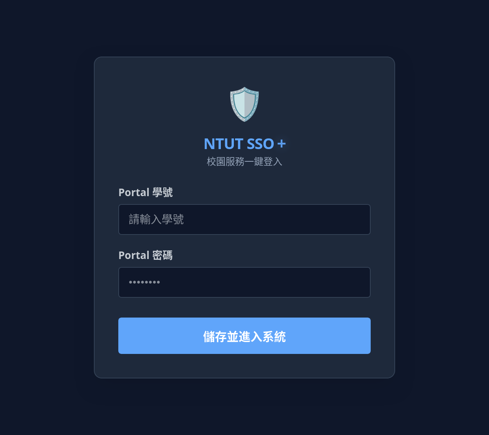
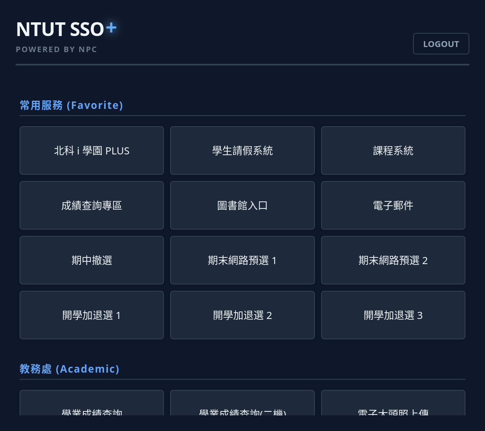

# 北科大 SSO+ 瀏覽器擴充功能

## 簡介

北科大 SSO+ 是一款為北科學生設計的 Chrome 擴充功能，提供統一介面快速存取學術、學務及其他校內服務，並支援免密碼及驗證碼快速登入校內系統。

## 螢幕截圖

## 功能

- 快速存取常用服務包含：

  - 北科 i 學園 PLUS

  - 學生請假系統

  - 課程系統

  - 成績查詢專區

  - 圖書館入口

## 支援瀏覽器

- Google Chrome

- Microsoft Edge

- Brave

- Chromium

## 安裝

1. 下載並解壓縮此 Repo。

2. 開啟 [chrome://extensions](chrome://extensions)。

3. 啟用頁面中的「開發者模式」。

4. 點擊「載入未封裝項目」，選擇「ntut_sso_plus」資料夾。

## 聲明

- **本專案為第三方工具，與國立臺北科技大學（NTUT）無官方關係。**

- **本擴充功能僅與 `*.ntut.edu.tw` 網域互動。**

- **使用者帳密只存於本機，不會回傳給開發者。**

- 程式不會傳送個資至非 `*.ntut.edu.tw` 網域。

- **有問題請於 GitHub 開 Issue，或聯絡 support@ntut.club。**

- **請勿就本專案問題聯絡國立臺北科技大學。**

- 若未來版本調整網路請求範圍，應同步更新 [`manifest.json`](./manifest.json) 權限與本 README 聲明。
