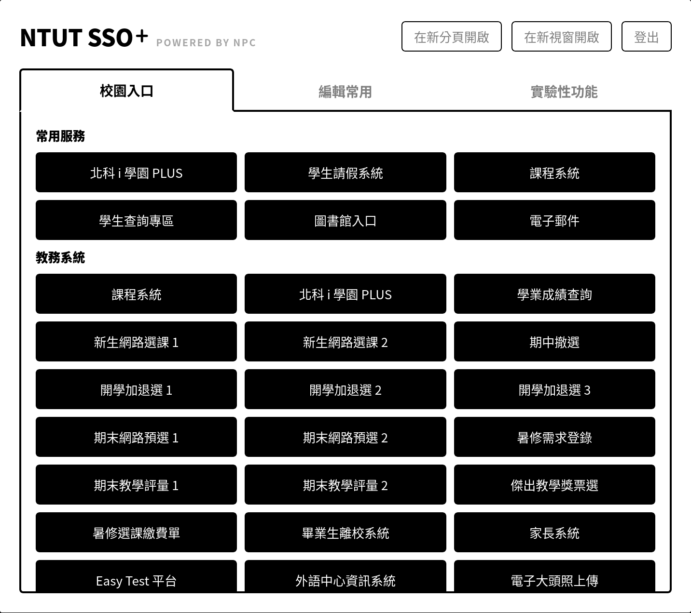
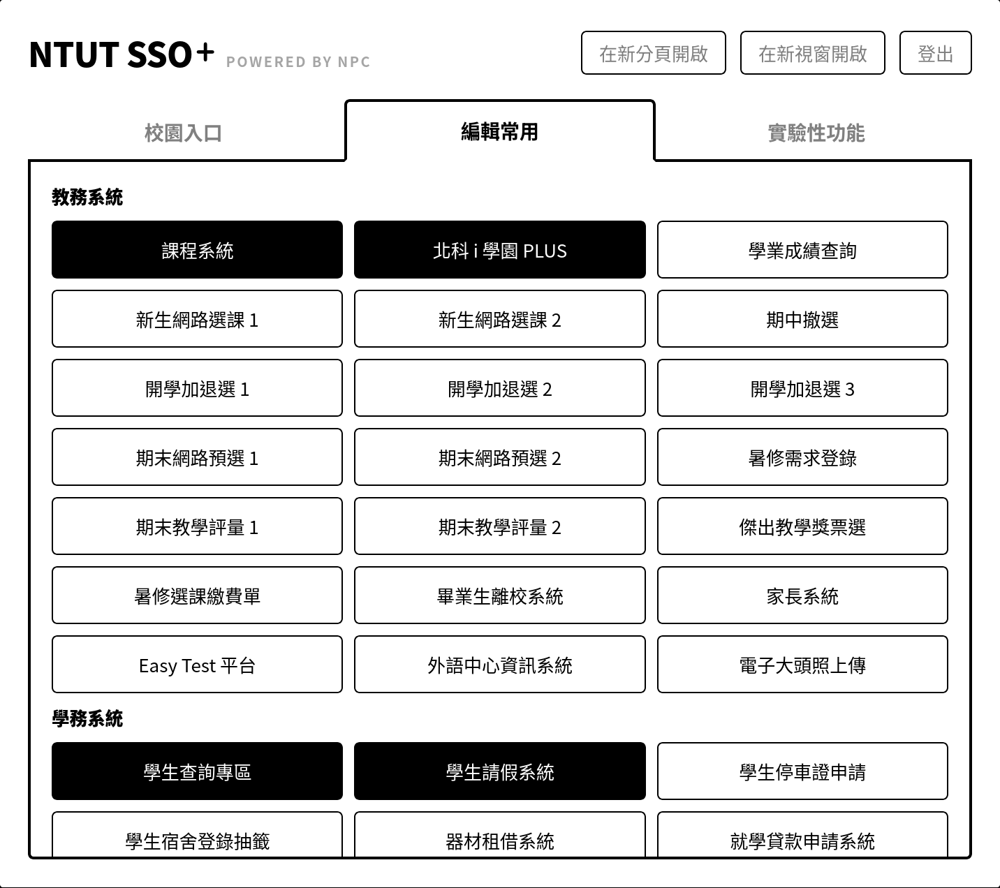
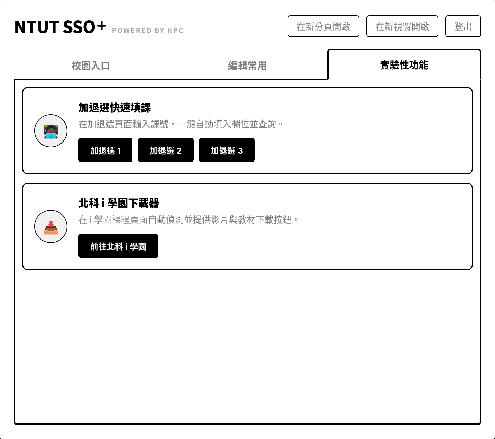
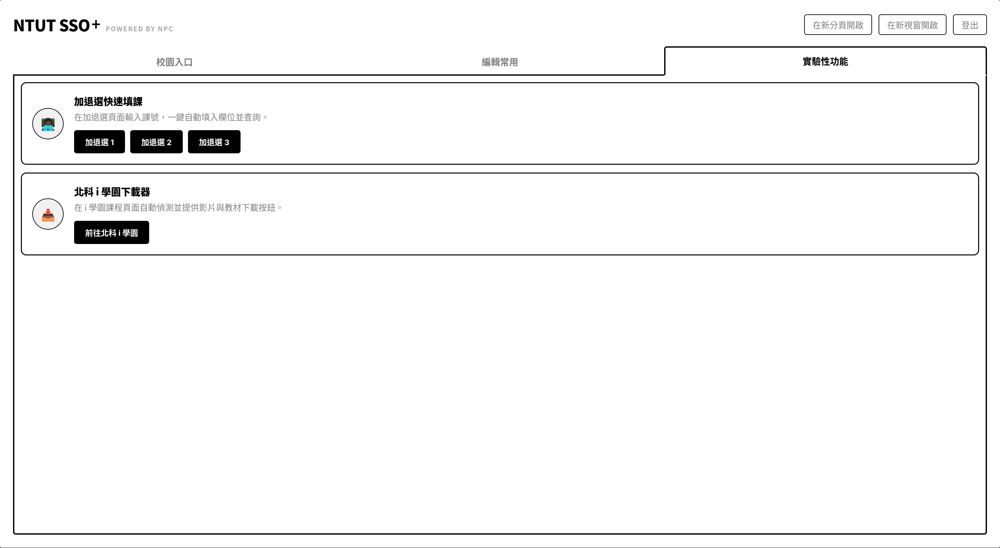
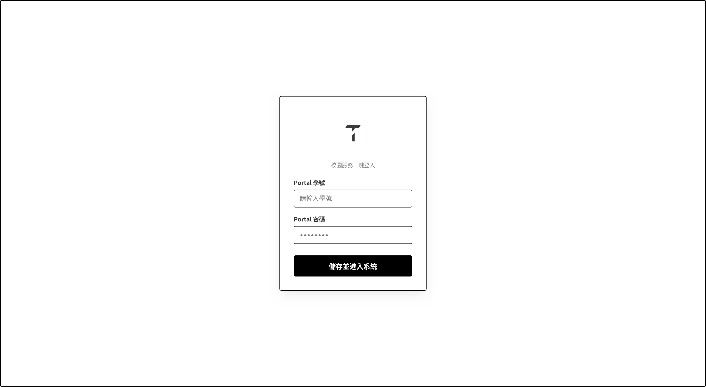
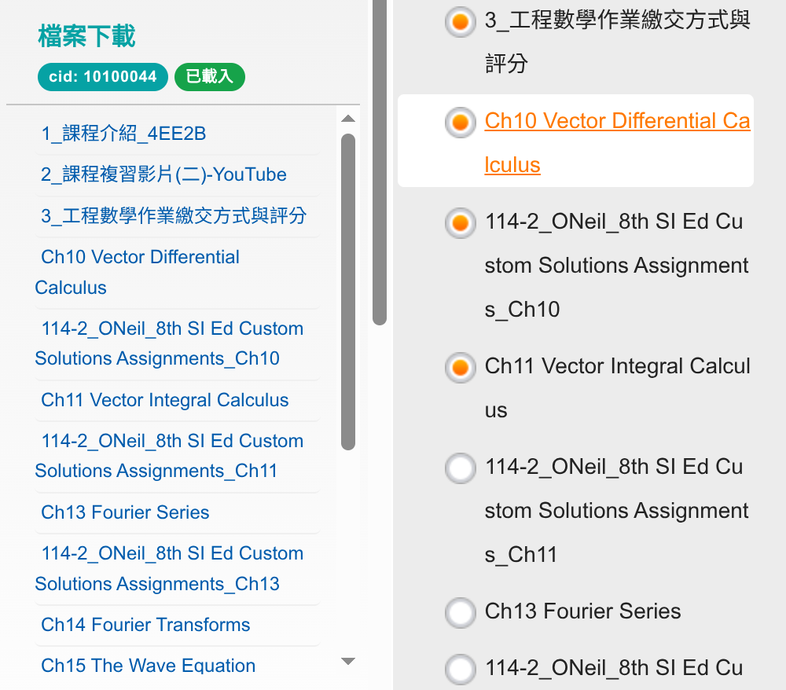

# 北科大 SSO+
## 簡介
北科大 SSO+ 提供統一且便捷的介面，讓北科學生快速登入校內各項服務，並提供課程教材下載功能。

## 功能特色
- **快速登入校內服務**：自動 SSO 跳轉，實現免密碼快速登入校內各大系統。
- **i 學園影片下載功能**：在 i 學園影片播放頁面中顯示下載按鈕
- **i 學園檔案下載功能**：下載所有課程檔案 (包括不開放下載的)
- **加退選系統自動填入**
- **客製化最愛捷徑**

## 安裝
### 從商店
|瀏覽器|Chrome|Edge|Brave|Firefox|Firefox Android|
|---|---|---|---|---|---|
|安裝連結|[Web Store](https://chromewebstore.google.com/detail/nppojibjajdjephkangpfamenpphamaj)|[Web Store](https://chromewebstore.google.com/detail/nppojibjajdjephkangpfamenpphamaj)|[Web Store](https://chromewebstore.google.com/detail/nppojibjajdjephkangpfamenpphamaj)|[Firefox 擴充套件](https://addons.mozilla.org/zh-TW/firefox/addon/ntut-sso-plus/)|[Android 擴充套件](https://addons.mozilla.org/zh-TW/android/addon/ntut-sso-plus/)|

> [!NOTE]
> Chrome Web Store 的版本會落後最新版至少一週，如果想體驗最新功能，建議手動安裝指定版本。

> [!CAUTION]
> Firefox Android 無法更新擴充套件，可能需要移除再重新安裝。
### GitHub Release

https://github.com/NTUT-NPC/ntut_sso_plus/releases

### Build from source
#### Chrome
```
npm run build
```
輸出會在 `ntut_sso_plus/dist/chrome-mv3/`
> [!IMPORTANT]
> 刪除 `chrome-mv3/` 將導致已安裝的擴充功能失效。
#### Firefox
```
npm run zip:firefox
```
輸出會在 `ntut_sso_plus/dist/ntutssoplus-26.xx.0-firefox.zip`
> [!IMPORTANT]
> 關閉 Firefox 後，從 about:bebugging 安裝的 Add-ons 都會被清除。

## 螢幕截圖








## 授權條款
- **程式碼授權 (Codes)**：採用 GPL v3 授權條款。
- **資源與素材 (Assets)**：不公開受權。

## 隱私與安全聲明
- **無官方代表性**：本專案為第三方開發之實用工具，與國立臺北科技大學 (NTUT　)無任何官方關聯。
- **限定互動網域**：本擴充功能僅會與北科大相關網域 `*.ntut.edu.tw`  (包含但不限於 `istream.ntut.edu.tw`)進行網路請求互動。
- **本地資料儲存**：使用者的登入帳號與密碼等敏感資訊**只會儲存於本機端**，絕對不會回傳至開發者伺服器或任何第三方。
- **資料保護承諾**：本程式保證不會傳送任何個人隱私資料至非 `*.ntut.edu.tw` 之網域伺服器。
- **問題回報**：如果您遇到任何問題，請前往 GitHub 開啟 Issue。
- **免責條款**：**請勿將關於本擴充功能之問題向國立臺北科技大學相關處室提出**。
- **權限說明**：若未來版本為了提供更新服務而調整網路請求存取範圍，開發團隊將同步更新 `manifest.json` 檔案中的權限與本 README 文檔之聲明。
